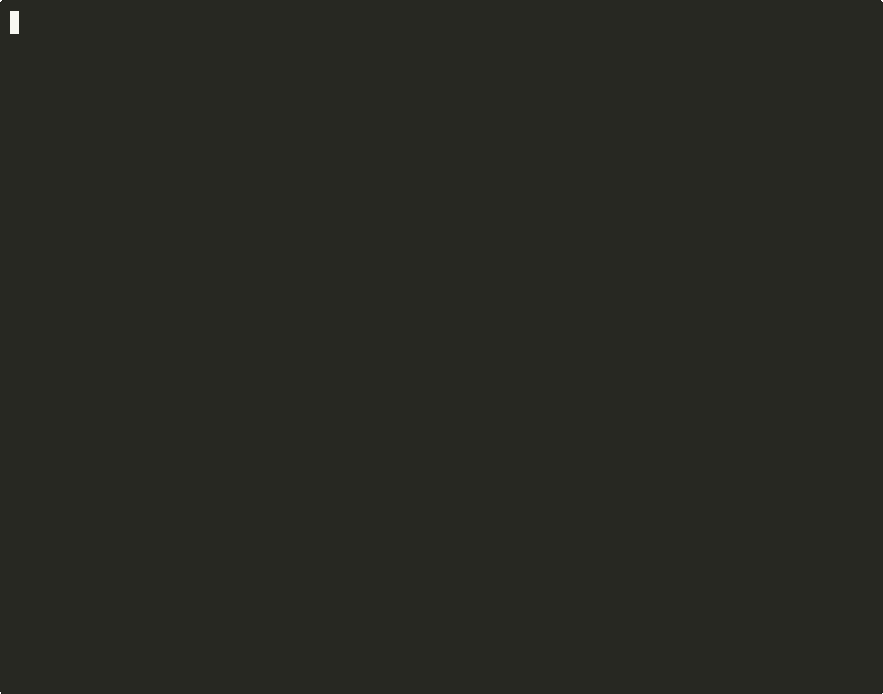

<div align="center">


### The only Claude Code plugin you need. 20 tools. 22 skills. Ship production-ready SaaS with one command.

[](https://www.npmjs.com/package/ultraship)
[](https://www.npmjs.com/package/ultraship)
[](https://www.npmjs.com/package/ultraship)
[](https://github.com/Houseofmvps/ultraship/stargazers)
[](LICENSE)
[](https://github.com/Houseofmvps/ultraship/actions)
[](https://github.com/sponsors/Houseofmvps)

---

[](https://x.com/kaileskkhumar)
[](https://www.linkedin.com/in/kailesk-khumar-soundararajan)
[](https://houseofmvps.com)

**Built by [Kaileskkhumar](https://www.linkedin.com/in/kailesk-khumar-soundararajan), solo founder of [houseofmvps.com](https://houseofmvps.com)**

*One indie hacker. One plugin. Everything you need to ship.*

</div>

---

<div align="center">



*SEO audit, secret scanning, and the /ship scorecard — all from your terminal.*

</div>

---

## Quick Start

```bash
# As a Claude Code plugin (recommended)
claude plugin add ultraship

# Or try standalone — no plugin install needed
npx ultraship ship .
npx ultraship seo .
npx ultraship security .
npx ultraship health https://yourapp.com
```

Then in Claude Code:

```bash
/ship          # Full pre-deploy audit + scorecard
/seo           # SEO/GEO/AEO audit
/secure        # Security scan
/perf          # Bundle size + Lighthouse audit
/deploy        # Build -> audit -> deploy -> health check
```

**Zero configuration.** Ultraship reads your project structure and self-configures.

---

## How It Works

**Everything is automatic.** You don't invoke skills manually — Ultraship detects what you're doing and activates the right skill at the right time. You just talk to Claude normally. Ultraship handles the discipline.

```
You: "I want to add Stripe webhooks"
                    ↓
    Brainstorming activates → asks clarifying questions → writes spec
                    ↓
    Planning activates → breaks spec into bite-sized tasks
                    ↓
    TDD activates → writes failing test first, then implementation
                    ↓
    Code review activates → catches issues before you merge
                    ↓
    /ship → scores your project → READY TO SHIP
```

**The agent checks for relevant skills before every action. These are mandatory workflows, not suggestions.** You don't need to remember commands or follow checklists. Your coding agent just has Ultraship.

Every skill listed below activates automatically based on context. Slash commands (`/ship`, `/seo`, etc.) exist as manual overrides when you want to trigger something specific — but you'll rarely need them.

---

## What Ultraship Does: A to Z

### 1. Brainstorming

> *Activates automatically when you describe something to build.*

You say "I want to add X." Ultraship doesn't let Claude jump straight to code. It:

- Asks clarifying questions to understand what you actually need
- Proposes 2-3 approaches with trade-offs (speed vs. scalability, simple vs. flexible)
- Writes a spec document for your approval before any code is written
- Captures edge cases and requirements you haven't thought of yet

**Why it matters:** Most bugs come from building the wrong thing, not building it wrong.

### 2. Planning

> *Activates automatically after a spec is approved.*

Ultraship breaks the approved spec into bite-sized implementation steps:

- Exact file paths and code changes for each step
- Test commands to verify each step works
- Commit messages pre-written for each step
- Every step is scoped to 2-5 minutes of work
- Dependencies between steps are mapped so nothing is done out of order

### 3. Test-Driven Development

> *Activates automatically during any implementation.*

Enforces red-green-refactor on every feature and bugfix:

- **Red:** Write the failing test first — no implementation code until the test exists
- **Green:** Write the minimum code to make the test pass
- **Refactor:** Clean up without changing behavior
- **Commit:** Each passing cycle gets its own commit

This isn't optional. Ultraship won't let you skip the test.

### 4. Implementation

> *Activates automatically when a plan exists.*

Executes the plan step by step with built-in review checkpoints:

- Follows the plan exactly — no scope creep
- Pauses at review checkpoints for you to verify
- Dispatches parallel agents for independent tasks (e.g., writing tests and updating docs simultaneously)
- Tracks progress with task lists so you always know where you are

### 5. Frontend Design

> *Activates automatically when building UI components or pages.*

- Creates distinctive, production-grade interfaces — not generic AI-looking templates
- Uses your existing stack (React + Tailwind + shadcn/ui or whatever you have)
- Handles responsive design, accessibility, animations, and dark mode
- Produces polished code that looks like a human designer built it

### 6. Systematic Debugging

> *Activates automatically when something breaks or a test fails.*

- Reproduces the bug first — no guessing
- Narrows down the root cause systematically (not "try this and see")
- Verifies the fix doesn't break anything else
- Writes a regression test so the bug never comes back

### 7. Code Review

> *Activates automatically after completing a major implementation step.*

Reviews code with confidence scoring:

- Rates each finding with confidence level (how sure it is this is actually a problem)
- Catches N+1 queries, missing error handling, security issues, performance anti-patterns
- Distinguishes between real issues and style preferences
- Provides specific fix suggestions, not vague "consider refactoring"

### 8. Refactoring

> *Activates automatically when restructuring code.*

- Verifies behavior doesn't change (tests must still pass)
- Handles renames, extractions, and structural changes cleanly
- Avoids over-engineering — only changes what needs changing

### 9. API Design

> *Activates automatically when creating or modifying API endpoints.*

- REST or RPC conventions applied uniformly
- Request/response schemas validated
- Error handling patterns standardized
- Versioning strategy considered upfront

### 10. Data Modeling

> *Activates automatically when working with database schemas.*

- Schema design with proper indexes, constraints, and relations
- Migration safety checks (Drizzle, Prisma, Knex)
- Identifies missing foreign key indexes before they cause slow queries

### 11. SEO / GEO / AEO Audit

> *Activates automatically when working on web pages or HTML content. Also available as `/seo`.*

**60+ rules** across three search optimization layers:

| Layer | What it means | What Ultraship checks |
|---|---|---|
| **SEO** | Traditional search (Google, Bing) | Meta tags, canonical URLs, heading hierarchy, image alt text, sitemap, robots.txt, structured data |
| **GEO** | Generative Engine Optimization (ChatGPT, Perplexity) | `llms.txt`, AI-friendly robots.txt, question-format headings, structured data for AI extraction |
| **AEO** | Answer Engine Optimization (featured snippets, voice) | FAQPage schema, concise answer paragraphs, speakable markup |

Plus: content scoring (Flesch-Kincaid readability), OG tag validation with image reachability, redirect chain detection, analytics detection (12 providers), cross-page canonical conflict detection.

### 12. Security Audit

> *Activates automatically when working on auth, secrets, or dependencies. Also available as `/secure`.*

| Check | Details |
|---|---|
| **Secret scanning** | AWS keys, Stripe keys, OpenAI keys, GitHub tokens, private keys, JWT secrets, database URLs |
| **OWASP patterns** | Dangerous code execution, innerHTML, SQL concatenation |
| **Dependency audit** | `npm audit` for known vulnerabilities |
| **Dependency health** | Unused deps, outdated packages, dead wrapper code detected via import graph analysis |

Reports issues with exact `file:line` locations and fix guidance.

### 13. Code Profiling

> *Runs automatically as part of `/ship`. Also available as `/profile`.*

Static analysis for backend anti-patterns:

- **N+1 queries** — database calls inside loops (with smart context: seed/demo loops downgraded to low severity)
- **Sync I/O in handlers** — readFileSync, execSync blocking the event loop
- **Unbounded queries** — findMany without take/limit, SELECT * without LIMIT
- **Missing indexes** — foreign keys without database indexes (Drizzle, Prisma)
- **Memory leaks** — module-scoped arrays with `.push()`, event listeners in handlers
- **Sequential awaits** — independent `await`s that should be `Promise.all()`
- **ReDoS risk** — dynamic RegExp from user input in handlers

### 14. Bundle Size Tracking

> *Runs automatically as part of `/ship`. Also available as `/bundle`.*

- Analyzes `dist/`, `build/`, `.next/`, `out/` directories (monorepo-aware)
- Reports JS/CSS/image sizes with top 10 largest files
- Detects heavy dependencies with lighter alternatives (`moment` -> `dayjs`, `lodash` -> native, `axios` -> `fetch`)
- Saves reports for before/after comparison
- Warns on unexpected growth between builds

### 15. Performance Audit

> *Activates automatically when optimizing site speed. Also available as `/perf`.*

- Runs Lighthouse via headless Chrome
- Extracts Core Web Vitals (LCP, FID, CLS) and diagnostics
- Identifies render-blocking resources, unoptimized images, missing compression
- Auto-fix suggestions for common issues

### 16. Content Quality

> *Runs automatically as part of SEO audit. Also available as `/content`.*

- **Flesch Reading Ease** and **Flesch-Kincaid Grade Level**
- Keyword density analysis with optional target keyword
- Thin content detection (< 300 words)
- Wall-of-text warnings (150+ word paragraphs)
- GEO heading analysis: are your H2s phrased as questions for AI search?
- Weighted scoring: word count, heading structure, readability, and quality deductions

### 17. Dependency Health

> *Runs automatically as part of `/ship`. Also available as `/deps`.*

- Detects unused dependencies via import graph analysis (not just grep — traces reachability from entry points)
- Identifies dead wrapper files (e.g., shadcn/ui components imported by nothing)
- Flags outdated packages with latest versions
- Works across monorepo workspace packages

### 18. Deploy Pipeline

> *Available as `/deploy`. Runs full pre-flight + deploy + post-deploy.*

```
Pre-flight checks -> /ship audit -> Deploy -> Health check -> Score saved
```

| Step | What happens |
|---|---|
| **Env validation** | Compares `.env.example` to actual env: catches missing/empty/placeholder vars |
| **Migration safety** | Detects pending DB migrations (Drizzle, Prisma, Knex) |
| **Bundle check** | Analyzes build output, warns on growth |
| **Ship audit** | Full `/ship` scorecard: blocks deploy if score < threshold |
| **Deploy** | `git push` (Vercel), `railway up`, or custom command |
| **Health check** | Hits production URL: status, response time, SSL cert, security headers |

### 19. Production Health Check

> *Available as `/health`. Checks your live production URL.*

```bash
/health https://yourapp.com
```

Checks: HTTP status, response time, SSL certificate validity and expiry (issuer, subject, days remaining), redirect chains, 6 security headers (HSTS, CSP, X-Frame-Options, X-Content-Type-Options, Referrer-Policy, Permissions-Policy).

### 20. Ship Scorecard

> *The flagship command. Run `/ship` when you're ready to deploy.*

Runs 5 tools in parallel, scores 4 categories, produces the final scorecard:

- **SEO/GEO/AEO** (seo-scanner + content-scorer + og-validator)
- **Security** (secret-scanner + dep audit)
- **Code Quality** (code-profiler + dep-doctor)
- **Bundle Size** (bundle-tracker)

Score >= 80? Ship it. Below 80? Fix the flagged issues and run again.

### 21. Release

> *Available as `/release`. Handles the full publish pipeline.*

- Generates changelog from git commits
- Bumps version (patch/minor/major) across package.json, plugin.json, marketplace.json
- Creates GitHub release with release notes
- Publishes to npm

### 22. Generators

> *Activate automatically when SEO infrastructure is missing.*

Ultraship generates what's missing:

- **sitemap.xml** — generated from your HTML files and routes
- **robots.txt** — AI-friendly (allows GPTBot, PerplexityBot, ClaudeBot, etc.)
- **llms.txt** — makes your project discoverable by AI assistants
- **structured data** — JSON-LD schema markup for your pages

### 23. Git Workflow

> *Activates automatically during branching, commits, and PRs.*

- Smart branching strategy (feature branches, clean history)
- Commit message conventions enforced
- PR creation with summary and test plan
- Merge strategy guidance (rebase vs. merge vs. squash)

### 24. CLAUDE.md Management

> *Activates at session start if CLAUDE.md is stale. Also available as `/revise-claude-md`.*

Updates your project's CLAUDE.md with learnings from the current session — conventions discovered, decisions made, patterns established. Future sessions start smarter.

### 25. Browser Testing

> *Available via Playwright MCP. Activates when verifying deployed pages.*

- Navigate, click, fill forms, take screenshots
- Verify deployed pages render correctly
- Test OAuth flows, redirects, form submissions
- Visual regression catching

### 26. Live Documentation

> *Available via Context7 MCP. Activates when you need library docs.*

- Pulls up-to-date docs for any library while you code
- No more outdated Stack Overflow answers or hallucinated APIs
- Works for any npm package, framework, or tool

---

## Sponsor This Project

I built Ultraship alone — nights and weekends, between building my own SaaS products. No VC funding. No team. Just one person who got tired of shipping blind and decided to fix it for everyone.

This plugin is **free forever.** No pro tier. No paywalls. No "upgrade to unlock." Every feature you just read about — all 20 tools, 22 skills, 5 agents — is yours, completely free.

But building and maintaining something this comprehensive takes real time. Every false positive I fix, every new scanner rule I add, every monorepo edge case I handle — that's time I'm not spending on my own products.

**If Ultraship saved you even one hour** — one deployment you didn't have to debug, one leaked secret it caught before production, one SEO issue it found before your launch — I'd be grateful if you considered sponsoring.

[](https://github.com/sponsors/Houseofmvps)

Thanks for using Ultraship. Now go ship something powerful.

*— [Kaileskkhumar](https://www.linkedin.com/in/kailesk-khumar-soundararajan), solo founder of [houseofmvps.com](https://houseofmvps.com)*

---

## The Problem

You're a solo founder. You just spent 3 hours building a feature. Now you need to ship it. Here's what happens next:

- You ask Claude to review your code. It says "looks good" without catching the N+1 query you just introduced.
- You forget to check if your OG tags work. Your launch post on Twitter shows a broken preview for 6 hours.
- You deployed without running Lighthouse. Your LCP is 4.2 seconds. Google is already de-ranking you.
- Your `.env` has a placeholder `sk-...` that made it to production. You find out when Stripe emails you about the leaked key.
- ChatGPT and Perplexity can't cite your content because you blocked AI crawlers in `robots.txt` and you don't have an `llms.txt`.
- Your bundle is 2.3MB because `moment.js` is still in there. You didn't know `dayjs` is 2KB.
- You push to production and pray. No health check. No SSL verification. No security header audit.

That's not shipping. That's gambling.

## The Solution

```bash
/ship
```

One command. 5 tools scan your entire project in parallel — SEO, security, code quality, bundle size, and dependency health. Gives you a score:

```
╔══════════════════════════════════════════╗
║      U L T R A S H I P   S C O R E      ║
╠══════════════════════════════════════════╣
║  SEO/GEO/AEO    92/100  ████████████░   ║
║  Security        95/100  ████████████░   ║
║  Code Quality    88/100  ███████████░░   ║
║  Bundle Size     97/100  ████████████░   ║
╠══════════════════════════════════════════╣
║   OVERALL         90/100                 ║
║   STATUS          READY TO SHIP          ║
╚══════════════════════════════════════════╝
```

**Score >= 80?** Ship it. **Below 80?** Fix the remaining items and run again.

---

## Dogfooded in Production

`/ship` on [SaveMRR](https://savemrr.co) (AI retention platform for indie SaaS — Hono + React + Drizzle pnpm monorepo):

**Backend + Dashboard (5 workspace packages, 41 route handlers):**

| Metric | Score |
|---|---|
| SEO/GEO/AEO | 63/100 |
| Security | 100/100 |
| Code Quality | 70/100 |
| Bundle Size | 100/100 |
| Overall | **83/100 — READY TO SHIP** |

**Landing Page (29 pre-rendered HTML pages):**

| Metric | Score |
|---|---|
| SEO/GEO/AEO | 52/100 |
| Security | 100/100 |
| Code Quality | 67/100 |
| Bundle Size | 92/100 |
| Overall | **78/100 — NEEDS WORK** |

**227 findings across both audits.** What it caught:

- **1 real N+1 query** in a background job (9 seed-data loops correctly downgraded to low priority)
- **33 unused dependencies** in landing page — dead shadcn/ui wrapper files detected via import graph analysis
- **153 SEO issues** — missing structured data, title/description length, no question-format headings for AI search
- **1 memory leak** — module-scoped array with `.push()` growing unbounded
- **1 heavy dependency** — `date-fns` detected in landing page bundle
- **SSL certificate** — valid, Let's Encrypt, 84 days until expiry

One command found all of this. No manual checklist. No guessing.

---

## What's Inside

| Category | Count | Highlights |
|---|---|---|
| **Tools** | 20 | SEO scanner (60+ rules), secret scanner, code profiler, bundle tracker, dep doctor, content scorer |
| **Skills** | 22 | Brainstorming, TDD, debugging, planning, code review, frontend design, verification |
| **Commands** | 17 | `/ship` `/seo` `/secure` `/perf` `/deploy` `/review` `/health` `/bundle` `/profile` `/deps` and more |
| **MCP Servers** | 2 | Live library docs (Context7), browser automation (Playwright) |

<details>
<summary><strong>All 17 commands</strong></summary>

| Command | What it does |
|---|---|
| `/ship` | Pre-deploy quality gate — 5 tools in parallel, scorecard |
| `/seo` | SEO/GEO/AEO audit (60+ rules) |
| `/secure` | Security scan — secrets, OWASP patterns |
| `/perf` | Bundle size + Lighthouse audit |
| `/deploy` | Full pipeline — env check, migrate, build, ship, health check |
| `/review` | Code review with confidence scoring |
| `/health` | Production health check (status, SSL, headers) |
| `/content` | Content quality — readability, keyword density, GEO headings |
| `/bundle` | Bundle size tracking with heavy dep detection |
| `/profile` | Backend anti-patterns — N+1, sync I/O, memory leaks |
| `/deps` | Unused/outdated dependency detection |
| `/redirects` | Redirect chain/loop checker |
| `/release` | Changelog, version bump, GitHub release, npm publish |
| `/brainstorm` | Idea-to-spec with clarifying questions |
| `/write-plan` | Spec to bite-sized implementation plan |
| `/execute-plan` | Execute plan with review checkpoints |
| `/revise-claude-md` | Update CLAUDE.md with session learnings |

</details>

---

## Security

| Protection | How |
|---|---|
| **No shell injection** | `execFileSync` with array args everywhere — zero shell interpolation |
| **SSRF protection** | All HTTP tools block private IPs, cloud metadata, non-HTTP schemes |
| **No telemetry** | Zero data collection. No phone-home. Ever. |
| **1 dependency** | `htmlparser2` only (30KB). No native bindings. No `node-gyp`. |
| **113 unit tests** | Security module, secret scanner, SEO scanner, code profiler, content scorer, dep doctor, CLI scorecard |
| **Secret redaction** | Found secrets truncated in output. Env values never logged. |
| **File safety** | 10MB read cap. 5MB response cap. Restrictive write permissions. |

See [SECURITY.md](SECURITY.md) for the full details.

---

## Philosophy

**Test-Driven, Not Vibe-Driven.** Red-green-refactor is enforced, not suggested. The agent writes the failing test before touching implementation code.

**Think First, Build Second.** Brainstorming and planning before code. The spec gets reviewed before the first line is written.

**Evidence Before Assertions.** Never claims "it works" without proof. The scorecard is evidence, not opinion.

**1 Dependency.** `htmlparser2` (30KB). No `node-gyp`. No supply chain surface area.

---

## Who Is This For?

- **Solo founders** building their first SaaS
- **Indie hackers** launching side projects
- **Bootstrapped teams** (1-3 people) who can't afford separate tools
- **Developers** who want one plugin instead of six

---

## Contributing

Found a bug? Want a new auditor? [Open an issue](https://github.com/Houseofmvps/ultraship/issues) or PR.

```bash
git clone https://github.com/Houseofmvps/ultraship.git
cd ultraship
npm test              # 113 tests, node:test
node tools/<tool>.mjs # No build step
```

---

## License

MIT — [LICENSE](LICENSE). **Free forever.** No pro tier. No paywalls.

---

<div align="center">

**If Ultraship helped you ship faster, [star the repo](https://github.com/Houseofmvps/ultraship) and tell a friend.**

[](https://github.com/Houseofmvps/ultraship/stargazers)

</div>
