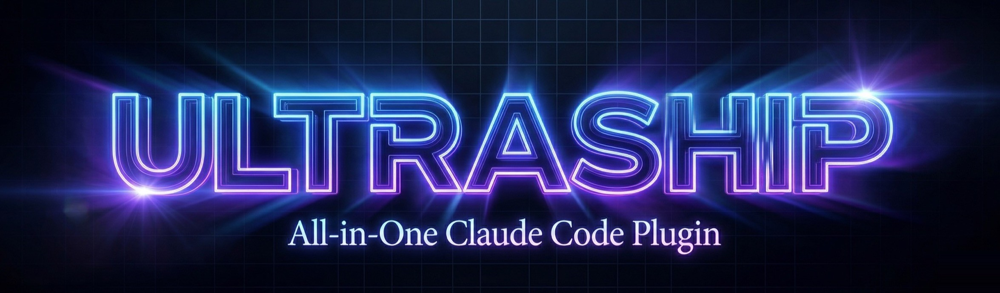

<div align="center">



### The only Claude Code plugin you need. 22 skills. 21 tools. 5 agents. Ship production-ready SaaS with one command.

[](https://www.npmjs.com/package/ultraship)
[](https://www.npmjs.com/package/ultraship)
[](https://www.npmjs.com/package/ultraship)
[](https://github.com/Houseofmvps/ultraship/stargazers)
[](https://github.com/Houseofmvps/ultraship/network)
[](LICENSE)

---

[](https://x.com/kaileskkhumar)
[](https://www.linkedin.com/in/kailesk-khumar-soundararajan)
[](https://houseofmvps.com)
[](https://github.com/Houseofmvps/ultraship)

**Built by [Kaileskkhumar](https://www.linkedin.com/in/kailesk-khumar-soundararajan), solo founder of [houseofmvps.com](https://houseofmvps.com)**

*One indie hacker. One plugin. Everything you need to ship.*

</div>

---

## The Problem

You're a solo founder. You just spent 3 hours building a feature. Now you need to ship it. Here's what happens next:

- You ask Claude to review your code. It says "looks good" without actually catching the N+1 query you just introduced.
- You forget to check if your OG tags work. Your launch post on Twitter shows a broken preview. You don't notice for 6 hours.
- You deployed without running Lighthouse. Your LCP is 4.2 seconds. Google is already de-ranking you.
- Your `.env` has a placeholder `sk-...` that made it to production. You find out when Stripe emails you about the leaked key.
- ChatGPT and Perplexity can't cite your content because you blocked AI crawlers in `robots.txt` and you don't have an `llms.txt` file. You didn't even know that was a thing.
- Claude hallucinated an API method that doesn't exist in Drizzle v0.36. You spent 45 minutes debugging before realizing the method was from v0.28.
- You have no CLAUDE.md, so every new conversation starts from scratch. Claude keeps suggesting Prisma even though you use Drizzle.
- You write code first, then tests (if ever). When something breaks in production, you guess at the root cause instead of tracing it systematically.
- Your bundle is 2.3MB because `moment.js` is still in there. You didn't know `dayjs` is 2KB.
- You push to production and pray. No health check. No SSL verification. No security header audit.

That's not shipping. That's gambling.

## The Solution

```bash
/ship
```

One command. Ultraship takes over. It dispatches 5 parallel agents across your entire project — SEO, performance, security, code quality, and browser testing. It runs 60+ rules, auto-fixes what it can, and gives you a score:

```
====================================
  ULTRASHIP SCORECARD
====================================
  SEO/GEO/AEO    92/100  [==========-]
  Performance     87/100  [========---]
  Security        95/100  [==========-]
  Code Quality    88/100  [========---]
  Browser Test    PASS

  OVERALL         90/100
  STATUS          READY TO SHIP
====================================
  Fixed: 7 issues auto-resolved
  Remaining: 2 manual items
====================================
```

**Score >= 80?** Ship it. **Below 80?** Ultraship already fixed 7 issues for you. Fix the remaining 2 and run again.

But `/ship` is just the final step. Ultraship changes how you build from the very first line of code.

---

## Quick Start

```bash
# Install as a Claude Code plugin (recommended)
claude plugin add ultraship

# Or install globally via npm
npm install -g ultraship
```

Then in any project:

```bash
/ship          # Full pre-deploy audit + auto-fix
/seo           # SEO/GEO/AEO audit only
/security      # Security scan only
/deploy        # Build -> audit -> deploy -> health check
```

**Zero configuration.** Ultraship reads your project structure and self-configures.

---

## How It Works

It starts before you write a single line of code.

When you tell Claude to build something, Ultraship doesn't let it jump straight into coding. The **brainstorming skill** activates first — it asks you clarifying questions one at a time, proposes 2-3 approaches with trade-offs, and presents a design for your approval. Once you sign off, the **planning skill** breaks it into bite-sized tasks with exact file paths, complete code, test commands, and commit messages. Every step is a 2-5 minute action.

Then comes the building. **Test-driven development** is enforced — not suggested. Write the failing test first. Run it. Implement the minimum code to pass. Run again. Refactor. Commit. For larger plans, **subagent-driven development** dispatches a fresh agent per task, each getting a two-stage review: first for spec compliance, then for code quality. When bugs appear, **systematic debugging** kicks in — no guessing, no random fixes. Reproduce, isolate, trace, verify.

When you're ready to deploy, one `/ship` command dispatches 5 parallel agents — SEO, performance, security, code quality, and browser testing — across your entire project. It runs 60+ rules, auto-fixes what it can, and produces a scorecard. Below 80? It tells you exactly what to fix. Above 80? Ship it.

After shipping, Ultraship monitors. Health checks hit your production URL for status codes, response times, SSL validity, and security headers. Audit scores are saved for trend tracking. Your CLAUDE.md gets updated with what you built.

And because skills trigger automatically based on what you're doing, you don't need to memorize commands or configure anything. Just have Ultraship installed and build. It handles the rest.

---

## The Basic Workflow

1. **Brainstorming** — Activates when you describe what you want to build. Explores requirements, proposes approaches, writes a spec.
2. **Writing Plans** — Activates after a spec is approved. Creates step-by-step implementation plan. DRY. YAGNI. Exact file paths.
3. **Test-Driven Development** — Activates before writing code. Enforces RED-GREEN-REFACTOR. No skipping steps.
4. **Subagent-Driven Development** — Activates when executing plans. Fresh agent per task. Two-stage review after each.
5. **Systematic Debugging** — Activates when something breaks. Root-cause tracing. Defense-in-depth. No guessing.
6. **Code Review** — Activates when work is done. Confidence scoring. Severity tagging. Security focus.
7. **Verification Before Completion** — Activates before claiming done. Evidence before assertions. Run tests, check output, then commit.
8. **/ship** — Your pre-deploy quality gate. 5 agents, 60+ rules, auto-fixes, scorecard.
9. **Deploy + Release** — Full pipeline with env validation, migration safety, health check, changelog, npm publish.

The agent checks for relevant skills before any task. Mandatory workflows, not suggestions.

---

## What's Inside

Ultraship is **22 skills, 18 commands, 21 tools, 5 agents, and 2 MCP servers** working as one system.

**Workflow Skills**
- **Brainstorming** — idea-to-spec with clarifying questions, approach proposals, visual companion for mockups
- **Writing Plans** — specs to bite-sized implementation plans with full code and test commands
- **Test-Driven Development** — enforced red-green-refactor (includes testing anti-patterns reference)
- **Systematic Debugging** — root-cause tracing methodology (includes defense-in-depth, condition-based waiting)
- **Subagent-Driven Development** — fresh agent per task with spec + quality review
- **Executing Plans** — batch execution with review checkpoints
- **Git Worktrees** — isolated feature work with smart directory selection
- **Code Review** — structured feedback with confidence scoring
- **Finishing Branches** — merge, PR, or cleanup guidance
- **Verification Before Completion** — evidence before assertions
- **Writing Skills** — create and test new skills with eval frameworks
- **Dispatching Parallel Agents** — concurrent independent tasks

**Specialist Skills**
- **Frontend Design** — production-grade Tailwind + shadcn/ui, no generic AI aesthetics
- **CLAUDE.md Management** — auto-create, audit, and revise project memory
- **SEO/GEO/AEO Audit** — 60+ rules across traditional, generative, and answer engine optimization
- **Security Audit** — deps, secrets, OWASP patterns, HTTP headers
- **Performance Audit** — Lighthouse, Core Web Vitals, bundle analysis
- **Deploy + Release** — full pipeline with health check and changelog generation

**Tools (21 Node.js modules)**
- SEO scanner (60+ rules), content scorer, OG validator, redirect checker, Lighthouse runner, health check, env validator, migration checker, bundle tracker, audit history, API smoke test, code profiler, dep doctor, GSC client, Bing Webmaster client, secret scanner, sitemap generator, robots.txt generator, structured data generator, llms.txt generator, shared security module

**Agents (5)**
- Ship orchestrator, SEO auditor, security auditor, performance auditor, browser verifier

**MCP Servers (2)**
- Live documentation lookup — fetches current, accurate docs for any library on the fly
- Browser automation — full browser control: navigate, click, fill, screenshot, verify

**Commands (18)**
- `/ship` `/deploy` `/review` `/seo` `/perf` `/security` `/health` `/content` `/bundle` `/profile` `/deps` `/redirects` `/release` `/design` `/brainstorm` `/write-plan` `/execute-plan` `/claude-md`

---

## Every Feature, Explained

### /ship: The Pre-Deploy Quality Gate

The flagship command. Dispatches 5 parallel agents, runs 10 inline checks, auto-fixes issues, and produces the scorecard.

**What it checks:**
- SEO/GEO/AEO: 60+ rules including meta tags, canonical URLs, structured data, llms.txt, AI crawler access
- Performance: Lighthouse via headless Chrome, Core Web Vitals, bundle size analysis
- Security: dependency vulnerabilities, secret scanning, OWASP patterns, HTTP headers
- Code Quality: N+1 queries, sync I/O in handlers, memory leaks, unused deps
- Browser: automated smoke tests on your running app

**What it auto-fixes:**
- Missing meta tags, broken canonical URLs, OG tag issues
- Security header middleware generation
- `.env` added to `.gitignore` if missing
- Safe dependency updates

---

### /seo: SEO / GEO / AEO Audit

**60+ rules** across three optimization layers:

| Layer | What it means | What Ultraship checks |
|---|---|---|
| **SEO** | Traditional search engines (Google, Bing) | Meta tags, canonical URLs, heading hierarchy, image alt text, sitemap, robots.txt, structured data |
| **GEO** | Generative Engine Optimization (ChatGPT, Perplexity, Gemini search) | `llms.txt`, AI-friendly robots.txt, question-format headings, structured data for AI extraction |
| **AEO** | Answer Engine Optimization (featured snippets, voice assistants) | FAQPage schema, speakable markup, concise answer paragraphs, definition patterns |

**Bonus tools:**
- Content quality scoring (Flesch-Kincaid readability, keyword density)
- OG tag validation with image reachability check
- Redirect chain/loop detection
- Analytics detection (GA4, Plausible, PostHog, and 7 more)
- Cross-page canonical conflict detection

---

### /security: Security Hardening

| Check | Details |
|---|---|
| **Dependency audit** | `pnpm audit` / `npm audit` / `yarn audit` with auto-fix |
| **Secret scanning** | AWS keys, Stripe keys, OpenAI keys, GitHub tokens, private keys, JWT secrets, database URLs |
| **OWASP patterns** | Dangerous code execution, innerHTML, SQL concatenation, mixed content |
| **HTTP headers** | CSP, HSTS, X-Frame-Options, X-Content-Type-Options, Referrer-Policy |
| **Dependency health** | Unused deps, outdated packages, pinned versions |

Finds issues AND fixes them. Generates security header middleware for your framework (Hono, Express, Next.js).

---

### /deploy: Full Deploy Pipeline

```
Pre-flight checks -> /ship audit -> Deploy -> Health check -> Score saved
```

| Step | What happens |
|---|---|
| **Env validation** | Compares `.env.example` to actual env: catches missing/empty/placeholder vars |
| **Migration safety** | Detects pending DB migrations (Drizzle, Prisma, Knex) |
| **Bundle check** | Analyzes build output size, warns on growth |
| **Ship audit** | Full `/ship` scorecard: blocks deploy if score < threshold |
| **Deploy** | `git push` (Vercel), `railway up`, `fly deploy`, or custom command |
| **Health check** | Hits production URL: status code, response time, SSL cert, security headers |
| **History** | Saves score for trend tracking |

---

### /review: AI Code Review

Reviews staged changes or a specific PR with:
- **Confidence scoring** - only flags issues it's sure about
- **Severity tagging** - critical, warning, suggestion
- **Inline diff references** - exact file and line
- **Security focus** - injection, XSS, auth bypass detection
- **Test gap analysis** - spots untested code paths

---

### /perf: Performance Audit

Lighthouse via headless Chrome with:
- Core Web Vitals extraction (LCP, CLS, TBT, FCP, SI, TTI)
- LCP element identification
- Unused JS/CSS quantification
- Third-party impact analysis
- Top 10 opportunities ranked by savings

---

### /health: Production Health Check

```bash
/health https://yourapp.com
```

Checks: HTTP status, response time, SSL certificate validity and expiry, redirect chains, 6 security headers, server identification. Gives you a health assessment with specific issues.

---

### /content: Content Quality Analysis

- **Flesch Reading Ease** and **Flesch-Kincaid Grade Level**
- Keyword density analysis with optional target keyword
- Thin content detection (< 300 words)
- Wall-of-text warnings (150+ word paragraphs)
- GEO heading analysis: are your H2s phrased as questions for AI search?

---

### /bundle: Bundle Size Tracking

- Analyzes `dist/`, `build/`, `.next/`, `out/` directories
- Reports JS/CSS/image sizes with largest files
- Detects heavy dependencies with lighter alternatives (`moment` -> `dayjs`, `lodash` -> native, `axios` -> `fetch`)
- Saves reports for before/after comparison with `--save`
- Warns on unexpected growth between builds

---

### /profile: Code Performance Analysis

Static analysis for backend anti-patterns:
- **N+1 queries** - database calls inside loops
- **Sync I/O** - blocking file reads in request handlers
- **Unbounded queries** - `findMany` without `take`/`limit`
- **Missing indexes** - foreign keys without database indexes
- **Memory leaks** - module-scoped arrays with `.push()`
- **Sequential awaits** - independent `await`s that should be `Promise.all()`

---

### /deps: Dependency Doctor

- Detects unused production dependencies via import scanning
- Finds unused dev dependencies
- Flags significantly outdated packages
- Recommends `^` for pinned versions
- Confirms before recommending removal

---

### /release: Automated Releases

Determines version bump from commit messages, generates changelog, bumps `package.json`, commits and tags, pushes, creates GitHub release, publishes to npm.

---

### /redirects: Redirect Chain Checker

- Follows redirect chains up to 10 hops
- Detects redirect loops
- Flags mixed HTTP/HTTPS chains
- Recommends 301 over 302 for SEO
- Supports bulk checking from sitemap

---

## Philosophy

**Test-Driven, Not Vibe-Driven.** Every feature gets tests first. Red-green-refactor is enforced, not suggested. The agent writes the failing test before touching implementation code.

**Think First, Build Second.** Most AI coding failures come from jumping straight to implementation. Ultraship's brainstorming and planning skills force a design phase. The spec gets reviewed before the first line of code is written.

**Evidence Before Assertions.** Ultraship never claims "it works" without proof. The verification skill requires running tests and checking output before marking anything as done. The `/ship` scorecard is evidence, not opinion.

**Zero Configuration.** Ultraship reads your project structure — `package.json`, directory layout, framework configs — and self-configures. No YAML files. No setup wizards. Install and build.

**1 Dependency.** The entire plugin ships with a single runtime dependency: `htmlparser2` (30KB SAX parser). No native bindings. No `node-gyp`. No supply chain surface area. Clean install on every machine.

---

## Security

Ultraship is secure by default. See [SECURITY.md](SECURITY.md) for the full details.

| Protection | How |
|---|---|
| **No shell injection** | All subprocess calls use `execFileSync` with array args, no shell interpolation |
| **SSRF protection** | All HTTP tools block private IPs, cloud metadata endpoints, non-HTTP schemes |
| **No telemetry** | Zero data collection. No analytics. No phone-home. Ever. |
| **No background processes** | Every tool is stateless: runs, outputs JSON, exits |
| **1 dependency** | `htmlparser2` only. No native bindings. No `node-gyp`. Clean install everywhere. |
| **Secret redaction** | Found secrets are truncated in output. Env values never logged. |
| **File safety** | 10MB read cap. 5MB response cap. Restrictive write permissions. |
| **Supply chain** | Lighthouse pinned to major version. No postinstall scripts. |

---

## Who Is This For?

Ultraship is built for **builders who ship fast and ship alone**:

- **Solo founders** building their first SaaS
- **Indie hackers** launching side projects
- **Micro-SaaS founders** ($0-50K MRR)
- **AI founders** building on Claude, GPT, or other LLMs
- **Bootstrapped teams** (1-3 people) who can't afford separate tools
- **SEO specialists** who want GEO/AEO optimization for AI search
- **Marketers** who want to audit content quality and social previews
- **Developers** who want one plugin instead of six

---

## Built By

<div align="center">

**[Kaileskkhumar](https://www.linkedin.com/in/kailesk-khumar-soundararajan)** - Solo founder of **[houseofmvps.com](https://houseofmvps.com)**

Building MVPs and shipping SaaS products as a one-person team. Ultraship was born from the frustration of juggling six different Claude Code plugins while trying to ship production-ready products fast.

*"I was spending more time configuring plugins than writing code. So I built one plugin that does everything."*

[](https://x.com/kaileskkhumar)
[](https://www.linkedin.com/in/kailesk-khumar-soundararajan)
[](https://houseofmvps.com)

</div>

---

## Contributing

Found a bug? Want a new auditor? Open an issue or PR.

```bash
git clone https://github.com/Houseofmvps/ultraship.git
cd ultraship
# No build step: edit tools/*.mjs directly
# Test with: node tools/<tool>.mjs <args>
```

---

## License

MIT - see [LICENSE](LICENSE) for details.

**Free forever.** No pro tier. No paywalls. No "upgrade for more scans."

---

<div align="center">

**If Ultraship helped you ship faster, [star the repo](https://github.com/Houseofmvps/ultraship) and tell a friend.**

[](https://github.com/Houseofmvps/ultraship/stargazers)

</div>
